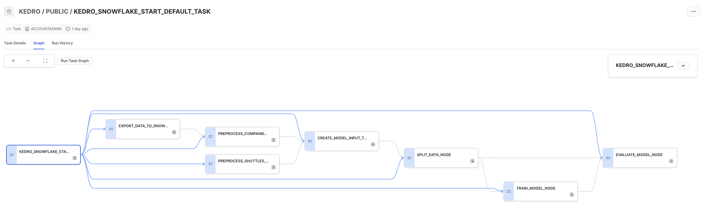

# Kedro Snowflake Pipelines plugin

[](https://github.com/getindata/kedro-snowflake)
[](https://opensource.org/licenses/Apache-2.0)
[](https://semver.org/)
[](https://pypi.org/project/kedro-snowflake/)
[](https://pepy.tech/project/kedro-snowflake)

[](https://sonarcloud.io/summary/new_code?id=getindata_kedro-snowflake)
[](https://sonarcloud.io/summary/new_code?id=getindata_kedro-snowflake)
[](https://kedro-snowflake.readthedocs.io/en/latest/?badge=latest)

<p align="center">
  <a href="https://getindata.com/solutions/ml-platform-machine-learning-reliable-explainable-feature-engineering"></a>
  <h3 align="center">We help companies turn their data into assets</h3>
</p>

## About
This plugin allows to run full Kedro pipelines in Snowflake. Right now it supports
* Kedro starter, to get you up to speed fast
* automatically creating Snowflake Stored Procedures from Kedro nodes (using Snowpark SDK)
* translating Kedro pipeline into Snowflake tasks graph
* running Kedro pipeline fully within Snowflake, without external system
* using Kedro's official `SnowparkTableDataSet`
* automatically storing intermediate data as Transient Tables (if Snowpark's DataFrames are used)

## Documentation
For detailed documentation refer to https://kedro-snowflake.readthedocs.io/

## Usage
### With starter
1. Install the plugin
    ```bash
    pip install "kedro-snowflake>=0.1.0" 
    ```
2. Create new project with our Kedro starter ❄️ _Snowflights_ 🚀:
    ```bash
    kedro new --starter=snowflights --checkout=master
    ```
    <details>
        <summary>And answer the interactive prompts ⬇️ (click to expand) </summary>
    
    ```bash
    Project Name
    ============
    Please enter a human readable name for your new project.
    Spaces, hyphens, and underscores are allowed.
     [Snowflights]: 
    
    Snowflake Account
    =================
    Please enter the name of your Snowflake account.
    This is the part of the URL before .snowflakecomputing.com
     []: abc-123
    
    Snowflake User
    ==============
    Please enter the name of your Snowflake user.
     []: user2137
    
    Snowflake Warehouse
    ===================
    Please enter the name of your Snowflake warehouse.
     []: compute-wh
    
    Snowflake Database
    ==================
    Please enter the name of your Snowflake database.
     [KEDRO]: 
    
    Snowflake Schema
    ================
    Please enter the name of your Snowflake schema.
     [PUBLIC]: 
    
    Snowflake Password Environment Variable
    =======================================
    Please enter the name of the environment variable that contains your Snowflake password.
    Alternatively, you can re-configure the plugin later to use Kedro's credentials.yml
     [SNOWFLAKE_PASSWORD]:       
    
    The project name 'Snowflights' has been applied to: 
    - The project title in /tmp/snowflights/README.md 
    - The folder created for your project in /tmp/snowflights 
    - The project's python package in /tmp/snowflights/src/snowflights
    ```
    </details>

3. Run the project
    ```bash
    cd snowflights
    kedro snowflake run --wait-for-completion
    ```

### In existing Kedro project
1. Install the plugin
    ```bash
    pip install "kedro-snowflake>=0.1.0" 
    ```
2. Initialize the plugin
    ```bash
    kedro snowflake init <ACCOUNT> <USER> <PASSWORD_FROM_ENV> <DATABASE> <SCHEMA> <WAREHOUSE>
    ```
3. Run the project
    ```bash
    kedro snowflake run --wait-for-completion
    ```
   
### Kedro pipeline in Snowflake Tasks



Execution:


