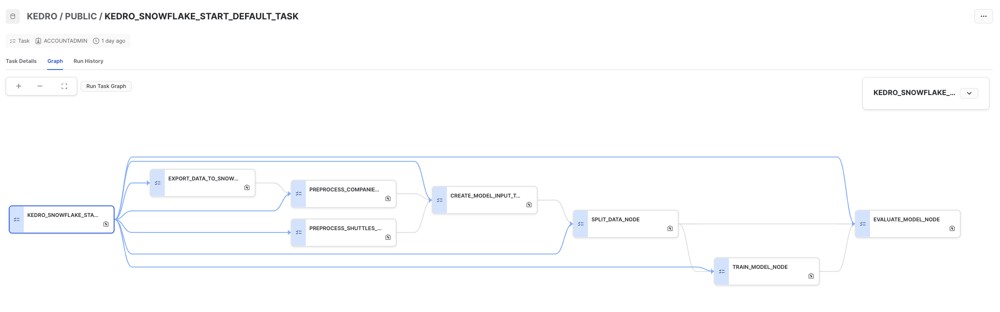

# Introduction

## What are Snowflake / Snowflake Tasks / Snowpark SDK?

[Snowflake](https://www.snowflake.com/en/) is a cloud-based data warehousing platform that provides scalable storage and analytics capabilities. It is designed to be highly flexible and allows users to store and process large amounts of data across multiple regions and clouds. Snowflake's unique architecture separates compute resources from storage, enabling users to scale up and down compute resources as needed without affecting their data.

[Snowflake Tasks](https://docs.snowflake.com/en/user-guide/tasks-intro) are a feature within Snowflake that allows users to define and manage complex data processing workflows. A task consists of one or more SQL statements and can be triggered automatically based on a predefined schedule or manually by a user. Tasks can be used to automate data integration and transformation processes, making it easier to maintain and manage complex data pipelines.

The [Snowpark Python SDK](https://docs.snowflake.com/en/developer-guide/snowpark/python/index) is a library that allows users to write Python code that interacts with Snowflake. With the Snowpark Python SDK, users can create and manage objects such as tables, views, and stored procedures, as well as execute SQL queries directly from Python. This enables users to leverage the full power of Python to create complex data processing workflows that seamlessly integrate with Snowflake.

## Why to integrate Kedro project with Snowflake?

The Kedro Snowflake plugin provides an efficient and scalable way to execute Kedro pipelines directly within Snowflake, leveraging Snowpark Python SDK. By using the plugin, users can seamlessly translate Kedro pipelines into Snowflake tasks and run them without the need for external systems. This makes it an ideal solution for users who need to scale up Kedro Machine Learning pipelines in Snowflake, with direct access to data.

