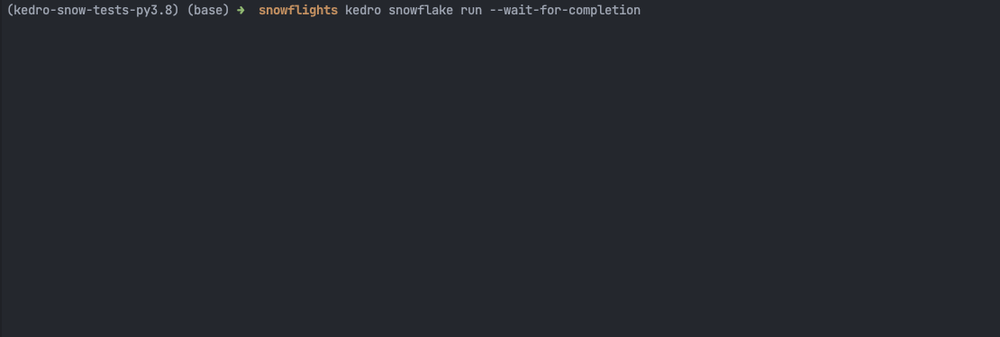
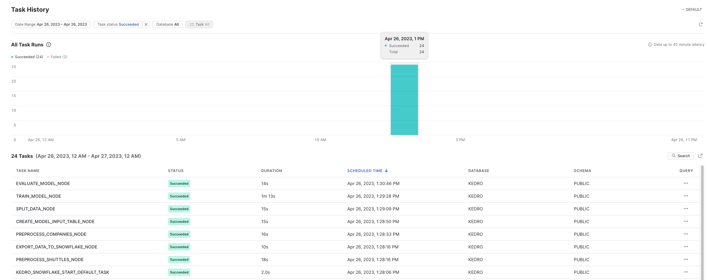

Quickstart
----------

Before you start, make sure that you have access to Snowflake account and prepare the following information:

-  Snowflake Username
-  Snowflake Password
-  Snowflake Account Name
-  Snowflake Warehouse Name
-  Snowflake Database Name
-  Snowflake Schema Name
-  Snowflake password (you will store it locally in an environment variable)

You will also need:

* Python 3.8 (must-have ⚠️ - this is enforced by the `snowflake-snowpark-python` package. Refer to `Snowflake documentation <https://docs.snowflake.com/en/developer-guide/snowpark/python/setup>`__ for more details.
* A tool to manage Python virtual environments (e.g. venv, conda, virtualenv). Anaconda is recommended by Snowflake.

-------

1. Prepare new virtual environment with Python == 3.8.

2. Install the plugin

.. code:: console

   pip install "kedro-snowflake>=0.1.0"

3. Create new project from our starter

.. code:: console

   kedro new --starter=snowflights

    Project Name
    ============
    Please enter a human readable name for your new project.
    Spaces, hyphens, and underscores are allowed.
     [Snowflights]:

    Snowflake Account
    =================
    Please enter the name of your Snowflake account.
    This is the part of the URL before .snowflakecomputing.com
     []: abc-123

    Snowflake User
    ==============
    Please enter the name of your Snowflake user.
     []: user2137

    Snowflake Warehouse
    ===================
    Please enter the name of your Snowflake warehouse.
     []: compute-wh

    Snowflake Database
    ==================
    Please enter the name of your Snowflake database.
     [KEDRO]:

    Snowflake Schema
    ================
    Please enter the name of your Snowflake schema.
     [PUBLIC]:

    Snowflake Password Environment Variable
    =======================================
    Please enter the name of the environment variable that contains your Snowflake password.
    Alternatively, you can re-configure the plugin later to use Kedro's credentials.yml
     [SNOWFLAKE_PASSWORD]:

    The project name 'Snowflights' has been applied to:
    - The project title in /tmp/snowflights/README.md
    - The folder created for your project in /tmp/snowflights
    - The project's python package in /tmp/snowflights/src/snowflights

4. The ``Snowflake Password Environment Variable`` is the name of the environment variable that contains your Snowflake password. Make sure to set in in your current terminal session. Alternatively, you can re-configure the plugin later to use Kedro's credentials.yml.
   For example (using env var):

.. code:: console

   export SNOWFLAKE_PASSWORD="super_secret!"

5. Go to the project's directory: ``cd snowflights``
6. Install the requirements

.. code:: console

   pip install -r src/requirements.txt

7. Launch Kedro pipeline in Snowflake

.. code:: console

   kedro snowflake run --wait-for-completion

After launching the command, you will see auto-refreshing CLI interface, showing the progress of the tasks execution.

|Kedro Snowflake Pipeline execution|

In Snowpark, you can also see the history of the tasks execution:
|Kedro Snowflake Tasks history|

-------

Advanced configuration
------------------
This plugin uses `*snowflake.yml` configuration file in standard Kedro's config directory to handle all its configuration.
Follow the comments in the example config, to understand the meaning of each field and modify them as you see fit.

.. code:: yaml

    snowflake:
      connection:
        # Either credentials name (Reference to a key in credentials.yml as in standard Kedro)
        # or leave
        # credentials: ~
        # and specify rest of the fields
        credentials: snowflake
    #    account: "abc-123"
    #    database: "KEDRO"
        # Name of the environment variable to take the Snowflake password from
    #    password_from_env: "SNOWFLAKE_PASSWORD"
    #    role: ~
    #    schema: "PUBLIC"
    #    user: "user2137"
    #    warehouse: "DEFAULT"
      runtime:
        # Default schedule for Kedro tasks
        schedule: "11520 minute"

        # Optional suffix for all kedro stored procedures
        stored_procedure_name_suffix: ""

        # Names of the stages
        # `stage` is for stored procedures etc.
        # `temporary_stage` is for temporary data serialization
        stage: "@KEDRO_SNOWFLAKE_STAGE"
        temporary_stage: '@KEDRO_SNOWFLAKE_TEMP_DATA_STAGE'

        # List of Python packages and imports to be used by the project
        # We recommend that this list will be add-only, and not modified
        # as it may break the project once deployed to Snowflake.
        # Modify at your own risk!
        dependencies:
          # imports will be taken from local environment and will get uploaded to Snowflake
          imports:
          - kedro
          - kedro_datasets
          - kedro_snowflake
          - omegaconf
          - antlr4
          - dynaconf
          - anyconfig
          # packages use official Snowflake's Conda Channel
          # https://repo.anaconda.com/pkgs/snowflake/
          packages:
          - snowflake-snowpark-python
          - cachetools
          - pluggy
          - PyYAML==6.0
          - jmespath
          - click
          - importlib_resources
          - toml
          - rich
          - pathlib
          - fsspec
          - scikit-learn
          - pandas
          - zstandard
          - more-itertools
          - openpyxl
          - backoff
        # Optionally provide mapping for user-friendly pipeline names
        pipeline_name_mapping:
         __default__: default

Snowflake datasets
------------------
This plugin integrates with Kedro's datasets and provides additional set of datasets for Snowflake.
The ``catalog.yml`` in our official Snowflights starter shows example usage of each of them:

.. code:: yaml

    companies:
      type: kedro_datasets.snowflake.SnowparkTableDataSet
      table_name: companies
      database: kedro
      schema: PUBLIC
      credentials: snowflake

    reviews:
      type: pandas.CSVDataSet
      filepath: data/01_raw/reviews.csv

    shuttles:
      type: pandas.ExcelDataSet
      filepath: data/01_raw/shuttles.xlsx
      load_args:
        engine: openpyxl # Use modern Excel engine, it is the default since Kedro 0.18.0

    preprocessed_shuttles:
      type: kedro_snowflake.datasets.native.SnowflakeStageFileDataSet
      stage: "@KEDRO_SNOWFLAKE_TEMP_DATA_STAGE"
      filepath: data/02_intermediate/preprocessed_shuttles.csv
      credentials: snowflake
      dataset:
        type: pandas.CSVDataSet