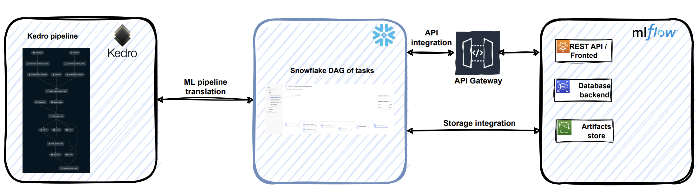

# [Beta] MLflow support

## High level architecture
The key challenge is to provide access to the external service endpoints (like MLflow)
that is currently not yet supported natively in Snowpark (External Access feature is on the Snowflake   roadmap). Snowflake external
functions are the preferred workaround.


## Implementation details
Kedro-Snowflake <-> MLflow integration is based on the following concepts:
 * [Snowflake external functions](https://docs.snowflake.com/en/sql-reference/external-functions-introduction) that
are used for wrapping POST requests to the MLflow instance. In the minimal setup the following wrapping external functions for MLflow REST API calls must be created:
    * [Create run](https://mlflow.org/docs/latest/rest-api.html#create-run)
    * [Update run](https://mlflow.org/docs/latest/rest-api.html#update-run)
    * [Log param](https://mlflow.org/docs/latest/rest-api.html#log-param)
    * [Log metric](https://mlflow.org/docs/latest/rest-api.html#log-metric)  
    * [Search experiment](https://mlflow.org/docs/latest/rest-api.html#search-experiments)
 * [Snowflake externa function translators](https://docs.snowflake.com/en/sql-reference/external-functions-translators) for
 changing the format of the data sent/received from the MLflow instance.
 * [Snowflake API integration](https://docs.snowflake.com/en/sql-reference/sql/create-api-integration) for setting up
 a communication channel from the Snowflake instance to the cloud HTTPS proxy/gateway service
 where your MLflow instance is hosted (e.g. Amazon API Gateway, Google Cloud API Gateway or Azure API Management). 
 * [Snowflake storage integration](https://docs.snowflake.com/en/sql-reference/sql/create-storage-integration) to enable
 your Snowflake instance to upload artifacts (e.g. serialized models) to the cloud storage (Amazon S3, Azure Blob Storage, Google Cloud Storage) used by the
 MLflow instance. 
## Configuration example

```yaml
  mlflow:
    # MLflow experiment name for tracking runs
    experiment_name: demo-mlops
    stage: "@MLFLOW_STAGE"
    # Snowflake external functions needed for calling MLflow instance
    functions:
      experiment_get_by_name: demo.demo.mlflow_experiment_get_by_name
      run_create: demo.demo.mlflow_run_create
      run_update: demo.demo.mlflow_run_update
      run_log_metric: demo.demo.mlflow_run_log_metric
      run_log_parameter: demo.demo.mlflow_run_log_parameter
```

## Kedro starter
The provided Kedro starter (Snowflights) has a builtin MLflow support.
You can enable it during the project setup, i.e.:
```bash
TBD
```

## Deployment to Snowflake and inference

### Deployment

### Inference with User Defined Function (UDF)
```sql
select
    MLFLOW$SNOWFLIGHTS_MODEL(
        "engines",
        "passenger_capacity",
        "crew",
        "d_check_complete",
        "moon_clearance_complete",
        "iata_approved",
        "company_rating",
        "review_scores_rating"
    ) AS price
from
    (
        select
            1 as "engines",
            100 as "passenger_capacity",
            5 as "crew",
            true as "d_check_complete",
            true as "moon_clearance_complete",
            true as "iata_approved",
            10.0 as "company_rating",
            5.0 as "review_scores_rating"
        union all
        select
            2,
            20,
            5,
            false,
            false,
            false,
            3.0,
            5.0
    );
```